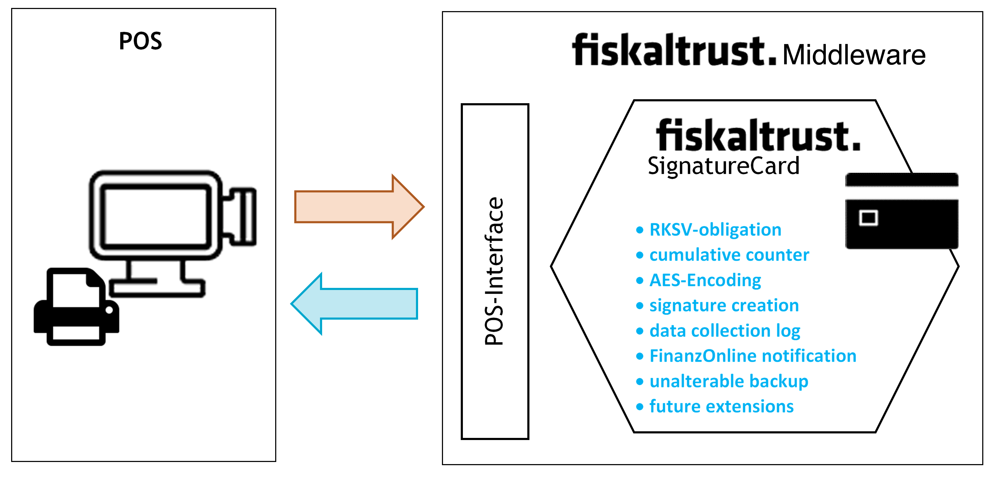
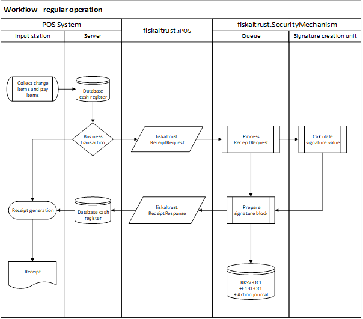
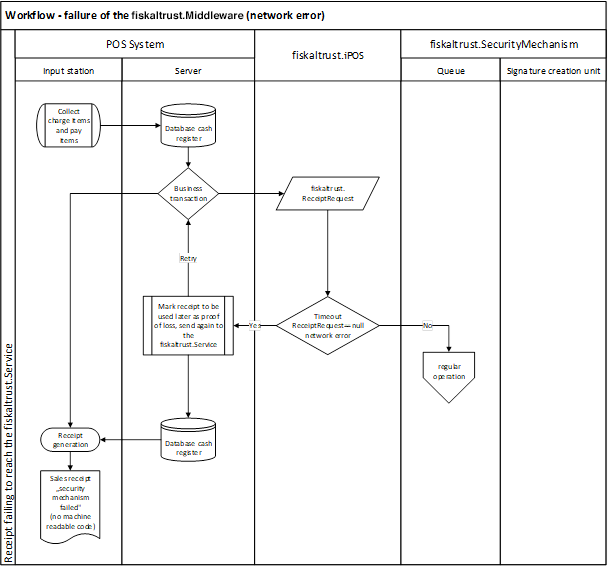
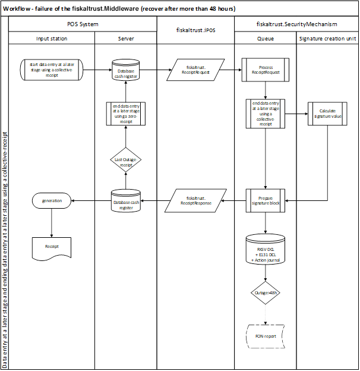

## Cash Register Integration

This chapter describes the cash register integration following the Austrian law. The general rules for cash register integration are described in the Chapter ["Cash Register Integration"](../../general/cash-register-integration/cash-register-integration.md) of the general part.

### Receipt Creation Process

This chapter describes the general process of creating receipts with fiskaltrust.Middleware and its workflow, following the Austrian law.

#### The fiskaltrust.SecurityMechanism

The regular workflow of the fiskaltrust.SecurityMechanism in the Austrian market defines the steps required for the creation of a receipt as follows:

  - assign a sequential receipt number
  - increase the cumulative sales counter according to the RKSV
  - encrypt the cumulative sales counter
  - create a signature
  - create machine-readable code according to the RKSV and
  - create all other necessary receipts
  - save all data

*Illustration* *12. Process of the cash register integration (AT) with fiskaltrust.SecurityMechanism (AT - RKSVO)*

#### Workflow - regular operation

The following diagram illustrates the regular creation of a receipt with fiskaltrust.Middleware following Austrian law.

*Illustration 13. Workflow - regular operation (AT - RKSVO)*

#### Workflow - special receipts

The following diagram illustrates the creation of a special receipt with fiskaltrust.Middleware following Austrian law.

*Illustration 14. Workflow - special receipts (AT) (initial-, zero-, collective- , closing-receipt, shift-, daily-, monthly-, yearly-tally) (AT - RKSVO)*

#### Workflow - failure of the signature creation unit (queue timeout)

The following diagram illustrates the workflow of a failure of the signature creation device following Austrian law.

*Illustration 15. Workflow - failure of the SCD (queue timeout) (AT - RKSVO)*

*Illustration 16. Workflow - failure of the SCD (wrong state) (AT - RKSVO)*

*Illustration 17. Workflow - failure of the SCD (SCD timeout) (AT - RKSVO)*

#### Workflow - failure of the fiskaltrust.SecurityMechanism (network error)

The following diagram illustrates the workflow of a failure of the fiskaltrust.SecurityMechanism following the Austrian law.

*Illustration 18. Workflow - failure of the fiskaltrust.SecurityMechanism (network error) (AT - RKSVO)*

*Illustration 19. Workflow - failure of the fiskaltrust.Middleware (recover after more than 48 hours) (AT - RKSVO)*

### Receipt for special functions

This section describes receipt types used for special functions on the Austrian market and expands on the descriptions from the Chapter ["Receipt for special functions"](../../general/cash-register-integration/cash-register-integration.md#c-receipt-for-special-functions-54) of the general part.

In accordance with §131b para. 2 BAO and the RKSV, as per 1.1.2017 (now 1.4.2017), each transaction receipt needs to be cryptographically signed with a signature creation device assigned to the taxpayer, to guarantee the immutability of the recording. In addition to these receipts, several other requirements are stated by the RKSV which can be met by creating the following receipts with special functions.

#### Zero Receipt

You can find examples of special cases of zero receipts applicable to the Austrian market in the following chapters.

#### Start Receipt (Initial Receipt)

There are many RKSV requirements for implementing a new, or a replaced security mechanism (RKSV-DEP). A new data collection log (RKSV-DEP) must be started, with the register ID used as a start value for the signature linking. An initial receipt must be issued after the implementation and must be checked for correctness. Such check is at fiskaltrust a verification if the certificate serial number of the data record corresponds with the number registered in the BMF security mechanisms database and if the signature matches the certificate's public key code.

The PosOperator must archive this receipt.

#### Stop Receipt (Closing Receipt)

In case of a scheduled decommissioning of a security mechanism or a cash register, the RKSV requires a generation of a closing receipt. The closing receipt concludes the data collection log (RKSV-DEP) and has to be archived.

At fiskaltrust.SecurityMechanisms, a scheduled decommissioning triggers after returning the data to the cash register and discarding the currently used certificate (so that the signature creation device (security mechanism) cannot issue any more valid signatures). Within the framework of the data collection log (RKSV-DEP), the certificate remains preserved. In the case of decommissioning, a "FinanzOnline" (finance online) notification is required (it will also be created through the fiskaltrust.SecurityMechanism).

Once the queue has been closed with a stop receipt, no hashing and signing of receipts will be done for that queue.

#### End of Failure Receipt (Collective Failure Report)

If, for technical reasons, signatures cannot be created by fiskaltrust.SecurityMechanisms, receipts need to be issued (according to the RKSV) and marked with a comment "security mechanism failed". Once the technical failure has been resolved, a signed collective receipt must be issued to make up for the signature linking of all receipts issued during the technical failure.

Furthermore, you can find two fundamentally different types of failure distinguished by fiskaltrust.SecurityMechanisms:

#### Signature Creation Device Failure

A signature creation device failure must be assumed if fiskaltrust.SecuritymMechanisms cannot communicate with the signature creation device temporarily. This can happen when e.g. the chip-card reader is faulty.

In case of a signature creation device failure, the machine-readable code from fiskaltrust.SecurityMechanisms (following the RKSV) is processed and sent back to the cash register. The status of the fiskaltrust.SecurityMechanism is communicated to the cash register input station with every response. The failure status can only be terminated through a zero receipt. Requesting the zero receipt can be done automatically through the input station or manually by the user.

The PosOperator must report a non-temporary failure (longer than 48 hours) of the signature creation device through FinanzOnline without undue delay. Afterwards, the return to service also must be reported through FinanzOnline. These reports are automatically done through the extension of the fiskaltrust.Carefree package.

#### fiskaltrust.SecurityMechanism Failure

A fiskaltrust.SecurityMechanism failure means that there is no access to the RKSV-DEP. If the failure lasts for more than 48 hours, the PosOperator must trigger a failure notification via FinanzOnline. When using fiskaltrust.Carefree, this notification is sent automatically. Otherwise, the notification regarding the reporting requirement is issued on the failure zero receipt.

#### Monthly Receipt

Before the beginning of a new monthly period, the preliminary result of the cumulative sales counter (monthly counter) has to be recorded accordingly to §8 Abs 2 RKSV. The cash register can request this monthly receipt via zero receipt from fiskaltrust.SecurityMechanisms for this purpose. The running sales counter is sent back to the cash register within the charge items block in an unencrypted format.

#### Annual Receipt

Before the beginning of a new annual period, the PosOperator must note the counter reading in accordance with §8 para. 3 RKSV. This procedure replaces the monthly receipt at the end of the year. As an additional requirement, the signature's correctness on this annual receipt needs to be checked against the database through fiskaltrust.SecurityMechanisms. When using fiskaltrust.Carefree, the check is processed automatically. Otherwise, the PosOperator can do it manually through the BMF App, which is available at:

https://www.bmf.gv.at/services/apps.html

### Receipt structure

This chapter describes the receipt structure applicable to the Austrian market.

*Illustration* *20. Receipt Structure (AT); cash register- receipt data (header, charge items, pay items, footer) and fiskaltrust-receipt data (header, charge items, pay items, signature, footer) (AT - RKSVO)*

#### Receipt Header

Following §132a para. 3 BAO, the receipt header should receive a label or a logo of the issuing company (see figure above) already from the cash register. For example, it is necessary for annual receipts where the heading "Annual Receipt" is added to a zero receipt (receipt with a value of zero).

#### Charge Items Block

The charge items block on the cash register receipt contains the services (quantity and customary description of the purchased goods or type and extent of other services following §132a para. 3 Z 4 BAO or else in the form of symbols, code numbers or reference displayed).

As previously mentioned, a Charge Items block can be extended through the fiskaltrust.SecurityMechanism. An example of such an extension is the monthly receipt where the sum of current business transactions (cumulative sales counter) is listed as a charge item within the charge items block of a zero receipt at the end of the month.

#### Pay Items Block

According to the RKSV, there are currently no specific applications where the pay items block should be extended.

#### Signature Block

If a cryptographic signature is required by §131b para. 2 BAO the signature block is generated by the fiskaltrust.SecurityMechanism. This includes receipt signature as required by RKSV, information about the signature format, and potential further details such as references to training or reverse posting, or an operational failure of the signature creation device. The cash register should contain the signature block between the Pay Items block and the Receipt Footer.

#### Receipt Footer

According to the RKSV, there is currently no specific information where the footer should be extended.

### Data Collection Log

The RKSV defines the following logging features as obligatory for cash registers.

#### Data Collection Log according to RKSV (RKSV-DEP)

The fiskaltrust.SecurityMechanism autonomously manages the RKSV-DEP. We recommend saving the values returned from the fiskaltrust.SecurityMechanism in the cash register's database. A connection between the return values and the receipt is established through the receipt reference of the cash register request and the receipt ID of the fiskaltrust.ReceiptResponse.

Data from the data collection log can also be provided in the form of a data stream, following the format specified by the RKSV.

When using the fiskaltrust.Carefree package, the RKSV-DEP is automated timely and saved in an external cloud, which is revision-safe and cannot be altered by the user.

#### Data Collection Log according to §131 para. 1 Z 6 b BAO (E131-DEP)

A E131-DEP, conducted by Cash Register, can be sent to fiskaltrust.SecurityMechanisms.

When using the fiskaltrust.Carefree package, the E131-DEP is automated timely and saved in an external cloud, which is revision-safe and cannot be altered by the user.
