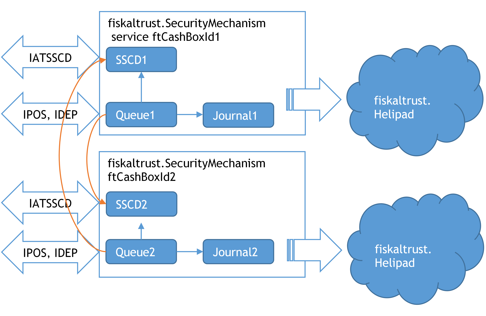

## Operation modes

### Components of the fiskaltrust.Middleware

#### ASP.net 5/Core Web App

An ASP.NET application provides the functionality of a queue via the REST service. It is available at:

<https://signaturcloud.fiskaltrust.at>

This application is the bridge between the queue nutshell and fiskaltrust.SignatureCloud. Thanks to the ASP.NET Core, the fiskaltrust.SignatureCloud can be used across platforms and can, after release, be run directly in a computing centre or on a server. As signature creation device, a HSM, or also another software signature creation device, can provide a closed overall system.

### SSCD Nutshell

In Austria it is mandatory to have an unmodifiable smartcard (write once read many) which must store the issued certificate containing the POS operator data. This smartcard must be read from a reader, which must be connected to the machine of the POS system via: internal device, connected external device, network connected device, or web service.

### Configuration of the fiskaltrust.Middleware

#### Online Portal

All configuration settings, as well as the relevant extensions, are managed via the online fiskaltrust.Portal, which for Austrian market is available at:

<https://portal.fiskaltrust.at>

#### Signature Creation Device (SSCD)

Signature creation devices used on the Austrian market have various characteristics and requirements.

SmartCard – it is the most simple form of a SSCD. It is connected directly via a USB connection to the hardware, which runs the fiskaltrust.SecurityMechanism. A PCSC driver, supported by the respective operating system is necessary for the chip-card reader to operate such local signature creation devices. Windows provides this for many chip-card readers. For Linux or Mac the [PCSC lite project](https://pcsclite.apdu.fr/) can be consulted.

Online signature service - a SSCD can also be used as an online service, where it is not necessary to access any local hardware in order to use it. However, for each signature an internet connection is required. An example for this type of SSCD module is the "atrustonline".

Another type of SSCD is an HSM module. Such module is usually installed on the local network and is not dependent on the internet connection. By using an HSM module, signing can be done extremely efficiently. These types of SSCD can be addressed with the SSCD module "lan".

On testing environments, a software based private key can be used for signing. Such software based certificate storage with public key and password encrypted private key is used in the SSCD module "pfx".

All signature creation devices can be directly addressed with the interface definition IATSSCD and per network. The fiskaltrust.SecurityMechanism uses the SSCD module "lan" to achieve this.

#### Queue

In this implementation, each receipt is processed accordingly with the RKSV requirements and signed with a configured signature creation device.

#### Journal

The Journal in Austria extracts the RKSV-DEP and includes the machine-readable code with the receipt signatures. It can also export the E131-DEP which provides a protocol for all receipt requests and responses. The journal also exports the processing protocol which records all events happening in the queue.

#### Notifications

Events are extracted from the notification-processing protocol. Special events have localized reporting requirements - for Austrian market they contain also the FinanzOnline notification according to the RKSV.

#### Configuration Scenarios

#### Single Queue scenario

In the simplest scenario, a fiskaltrust.SecurityMechanism consists of a single signature creation device and a single Queue with a data collection protocol (RKSV-DEP).

*Illustration 21. Single Queue scenario (AT)*

#### Scenario with several queues for performance improvement

In order to handle scenarios of higher complexity, a fiskaltrust.SecurityMechanism can also consist of several signature creation devices (SSCD) and several queues with data collection protocols (RKSV-DEP). If there are several Queues in a fiskaltrust.SecurityMechanism, a load balancer can be used to maximize the performance, and also as a backup outage scenario. In a backup outage scenario signature creation devices (SSCD) can also be used across services.

The fiskaltrust.SecurityMechanism illustrated below hosts several Queues. Each Queue runs a RKSV-DEP and a E131-DEP. The Queues can address a signature creation device available within a pool.

*Illustration 22. Scenario with several Queues for performance improvement (AT)*

#### Cash Register Network with Backup SSCD

As with the fiskaltrust.SecurityMechanism, the signature creation device is also available via network, and it is possible to use a signature creation device of a different cash register system in backup mode (indicated by the orange access line on the following illustration). Legal prerequisite for this is the registration of both signature creation devices with the same tax payer.

*Illustration 23. Several fiskaltrust.SecurityMechanisms use the SSCD via network*
