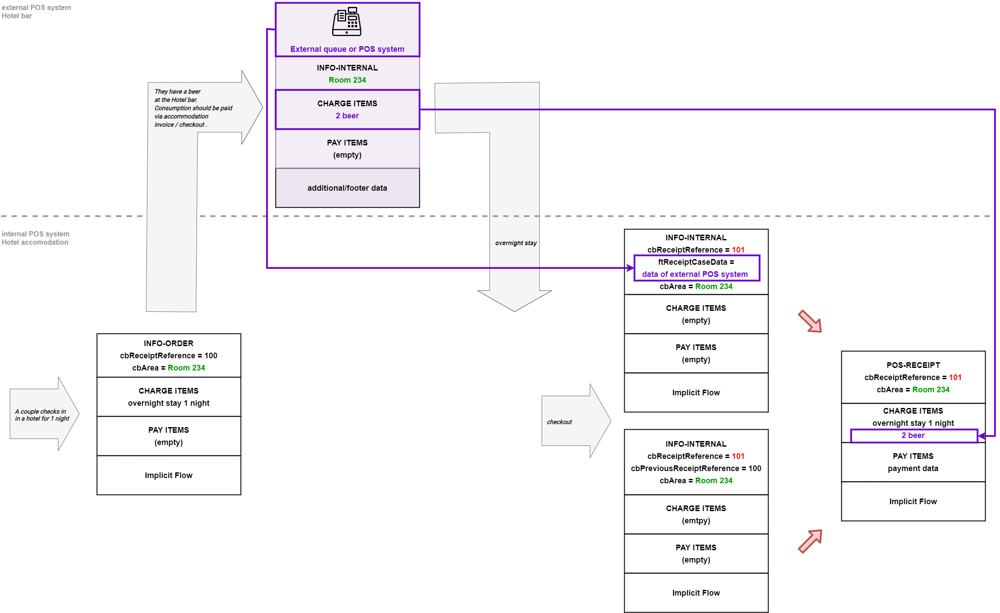

# Receipt sequences

In the chapter [Cash register integration](https://docs.fiskaltrust.cloud/docs/poscreators/middleware-doc/general/cash-register-integration#receipt-creation-process), the creation of single receipts using either implicit and/or explicit flow has been described.

In this chapter, the options to connect single receipts to receipt sequences for integrating complex business cases are described.

## Referencing previous receipts within a queue

#### Use case examples

- multiple (long lasting) transactions/orders/consumptions before payment is made (gastronomy, ...)

#### How to use

Connect requests representing a business action with [cbReceiptReference](https://docs.fiskaltrust.cloud/docs/poscreators/middleware-doc/germany/data-structures#single-fields).

#### Workflow example

Two friends are having a beer in a bar.  Because it is German beer, they are ordering another one. They pay with one bill.

#### Code examples

Code examples of receipt sequences can be found in our [postman collection](https://middleware-samples.docs.fiskaltrust.cloud/#e9b0b712-2dda-4c4c-a061-16d72daa723b).

## Splitting receipts

#### Use case examples

- Order(s) paid by multiple people
- Order(s) with down payment and final payment

#### How to use

Use [cbReceiptPreviousReference](https://docs.fiskaltrust.cloud/docs/poscreators/middleware-doc/germany/data-structures#single-fields) to point to a cbReceiptReference of a previous request to split or void a receipt.

#### Workflow example

Two friends are having a beer in a bar.  Each of them is paying his own consumption. Therefore, the receipt has to be split.

### Code examples

Code examples of splitting receipts can be found in our [fiskaltrust.Middleware](https://middleware-samples.docs.fiskaltrust.cloud/#86967a8f-a1fe-4262-975e-c4a155209cb3).

## Merging receipts

#### Use case examples

#### How to use

Merge receipts by combining [cbReceiptReference and cbReceiptPreviousReference](https://docs.fiskaltrust.cloud/docs/poscreators/middleware-doc/germany/data-structures#single-fields). Use ftReceiptCase `0x4445000000000013` (Info-internal) to create a new cbReceiptReference and refer via cbPreviousReceiptReference to the order you want to merge. Repeat this for each order you want to merge using the same cbReceiptReference and using cbPreviousReceiptPreference to point to the order to be merged.

#### Workflow example

Two friends are having a beer in a bar. One of them has birthday. To celebrate that, he invites the guests on the table next to them to pay what they have ordered and consumed so far. Therefore, their receipt has to be merged with the other receipt.

#### Code examples

Code examples of merging receipts can be found in our [postman collection](https://middleware-samples.docs.fiskaltrust.cloud/#b81fedc6-919a-46e4-899a-52582606a6d7).

## Changing the area in which the receipt is created

#### Use case examples

Changing the area of value creation; e.g.

- Consumption in Restaurant-Hotel -> Restaurant-Wellness -> Bar-Sauna
- Moving between different tables within a Restaurant
- Identifying a business action across multiple POS systems

#### How to use

Document the field/section in which the receipt is created with [cbArea](https://docs.fiskaltrust.cloud/docs/poscreators/middleware-doc/general/data-structures#receipt-request).

#### Workflow example

Two friends are having a beer in a bar on a big table. They change to a smaller table so that a bigger group of people can sit on their previous table to order some food.

## Referencing receipts of external queues or external Systems

#### Use case examples

When multiple POS systems are involved in the business action and only one is used for invoice/receipt creation, e.g.:

- Restaurant/Bar using multiple queues; orders are done with one queue and payment with another queue
- Restaurant/Wellness/Hotel using different POS systems; one system is used for final invoice creation
- Membership cards/vouchers with multiple POS systems involved

### Option A: ChargeItems collected via "internal" queue are payed at an external system or queue

#### How to use

ChargeItems are collected via ftReceiptCase 'Info-internal' or 'Info-order'. 'cbArea' can be used as an identifier for documenting the business action across multiple POS systems. The obligation to issue receipts arises at the external POS system.

#### Workflow example

### Option B: ChargeItems collected at an external system or queue are payed at the internal queue

#### How to use

When creating the POS receipt, use [ftReceiptCaseData](https://docs.fiskaltrust.cloud/docs/poscreators/middleware-doc/germany/dsfinv-k#file-bon_referenzen-referencescsv) to add the transaction data from the external POS system according to the requirements of the DSFinV-K-specification. The obligation to issue receipts arises at the POS system where the POS receipt is being created.

#### Workflow example

## Money substitutes based sequences (vouchers, membership cards,...)

prepaid

redemption