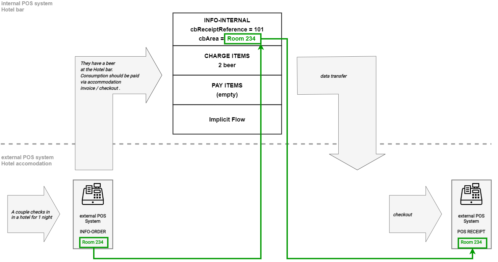

# Receipt sequences

In the chapter [Cash register integration](https://docs.fiskaltrust.cloud/docs/poscreators/middleware-doc/general/cash-register-integration#receipt-creation-process), the creation of single receipts using either implicit and/or explicit flow has been described.

In this chapter, the options to connect single receipts to receipt sequences for integrating complex business cases are described.

## Referencing previous receipts within a queue

You can use [cbReceiptReference](https://docs.fiskaltrust.cloud/docs/poscreators/middleware-doc/germany/data-structures#single-fields) to connect requests representing a business action:

Two friends are having a beer in a bar.  Because it is German beer, they are ordering another one. They pay with one bill.

### Code examples

Code examples of receipt sequences can be found in our [postman collection](https://middleware-samples.docs.fiskaltrust.cloud/#e9b0b712-2dda-4c4c-a061-16d72daa723b).

## Splitting receipts

You can use [cbReceiptPreviousReference](https://docs.fiskaltrust.cloud/docs/poscreators/middleware-doc/germany/data-structures#single-fields) to point to a cbReceiptReference of a previous request to split or void a receipt:

Two friends are having a beer in a bar.  Each of them is paying his own consumption. Therefore, the receipt has to be split.

### Code examples

Code examples of splitting receipts can be found in our [fiskaltrust.Middleware](https://middleware-samples.docs.fiskaltrust.cloud/#86967a8f-a1fe-4262-975e-c4a155209cb3).

## Merging receipts

You can merge receipts by combining [cbReceiptReference and cbReceiptPreviousReference](https://docs.fiskaltrust.cloud/docs/poscreators/middleware-doc/germany/data-structures#single-fields):

Two friends are having a beer in a bar. One of them has birthday. To celebrate that, he invites the guests on the table next to them to pay what they have ordered and consumed so far. Therefore, their receipt has to be merged with the other receipt.

### Code examples

Code examples of merging receipts can be found in our [postman collection](https://middleware-samples.docs.fiskaltrust.cloud/#b81fedc6-919a-46e4-899a-52582606a6d7).

## Changing the area in which the receipt is created

You can document the field/section in which the receipt is created with [cbArea](https://docs.fiskaltrust.cloud/docs/poscreators/middleware-doc/general/data-structures#receipt-request):

Two friends are having a beer in a bar on a big table. They change to a smaller table so that a bigger group of people can sit on their previous table to order some food.

## Referencing receipts of external queues or external Systems

### ChargeItems collected via "internal" queue are payed at an external system or queue

ChargeItems are collected via Info-internal or Info-order. cbArea can be used as an identifier for documenting the business action across multiple POS systems. The obligation to issue receipts arises at the external POS system.

### ChargeItems collected at an external system or queue are payed at the internal queue

## Money substitutes based sequences (vouchers, membership cards,...)

prepaid

redemption