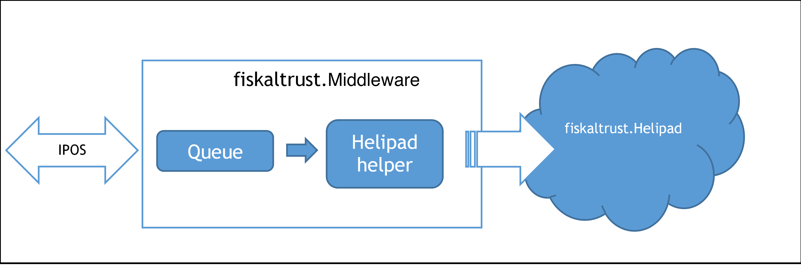
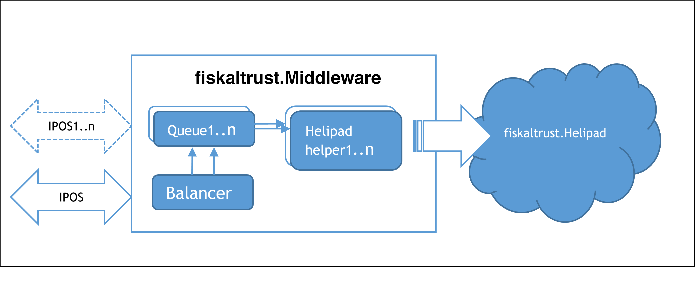

## Operation Modes

### Components of the fiskaltrust.Middleware

Regardless of the characteristics of the product, fiskaltrust.Middleware consists of several logical components. This chapter provides an overview on these components.

#### Launcher

The Launcher is a software (file) named `fiskaltrust.exe`, which is used only for the on-premise installed products (e.g. AT products fiskaltrust.SignatureCard or fiskaltrust.SignatureBox). For Windows, it is a .NET command-line application and a .NET Windows service. For Linux and Mac, the launcher can be executed via Mono, version 3.2.8 or higher, or used as daemon.

The main tasks of the launcher are:

  - providing basic configuration settings such as ftCashBoxId and access token
  - comparing the configuration data retrieved from fiskaltrust.Helipad with the local configuration
  - updating nutshells accordingly to the configuration
  - execution of configured nutshells
  - load balancing of multiple queues

The executable file `fiskaltrust.exe` and the corresponding DLLs can be distributed via copy-paste and then configured and installed with the help of a command-line parameter. It can be downloaded (incl. configuration) from the Portal’s configuration-\>cashbox page, or found on nuget.org and configured manually.

#### ASP.<span></span>net 5/Core Web App

An ASP.<span></span>NET application provides the functionality of a queue via the REST service. This service is provided only on selected markets. For details, please refer to country specific appendix.

#### SSCD Nutshell

The SSCD (Secure Signature Creation Device) nutshell serves to encapsulate the communication with a signature creation device. The respective signature creation device can be accessed via different channels: directly, locally, or via network. This service is provided only on selected markets. For details, please refer to country specific appendix.

#### Queue Nutshell

The queue nutshell serves to encapsulate the functionality of a receipt chain for various platforms and localisations. In accordance with the interface description, the queues can be addressed individually or via a load balanced channel of the launcher.

#### Helper Nutshell

The Helper nutshell is used to support updates and configurations.

#### fiskaltrust.SignaturCloud

The fiskaltrust.SignaturCloud is a pure online solution. The receipt linking is handled entirely online. The advantage of this solution is that no installation or configuration is required for the client and any platform can use this service.

The fiskaltrust.SignaturCloud currently has two different versions:
 - 1.1
 - 1.2

We differentiate between them by backend servers. So the external url is the same: https://signaturcloud.fiskaltrust.at for both versions. If you want to use a specific version of fiskaltrust.SignaturCloud, you will need to set the service-version field into the request header. HTTP header fields are components of the header section of request and response messages in the Hypertext Transfer Protocol (HTTP). They define the operating parameters of an HTTP transaction. If you want to read more about the HTTP headers, you can find details on the following link: https://en.wikipedia.org/wiki/List_of_HTTP_header_fields. As default the fiskaltrust.SignaturCloud 1.1 version is used.

```
Example:
curl -X GET https://signaturcloud.fiskaltrust.at/api/version -H 'service-version: 1.2'

[
  "fiskaltrust.space.signaturcloud",
  "1.49.19218.17628-dev+f5672f3d7a",
  "1.49.19218.17628",
  "Service package:fiskaltrust.service.azure.net46.dll",
  "Service product version:1.2",
  "Service file version:1.2.19089.12258"
]

curl -X GET https://signaturcloud.fiskaltrust.at/api/version or
curl -X GET https://signaturcloud.fiskaltrust.at/api/version -H 'service-version: 1.1'
[
  "fiskaltrust.space.signaturcloud",
  "1.1",
  "1.1.17249.2687"
]
```

### Configuration of the fiskaltrust.Middleware

#### Online Portal

All configuration settings, as well as the relevant extensions, are managed via the online fiskaltrust.Portal. For further information, refer to the appropriate appendix.

#### Queue

A Queue is a part of communication line between the POS-System and the fiskaltrust.Middleware. All regular receipts created by the POS-System are sent to the fiskaltrust.Middleware to get secured and stored in the Queue, and the response of the fiskaltrust.SecurityMechanism is sent back. All special receipts (for example the periodical closings) are sent as "requests to execute a special function" to the fiskaltrust.Middleware and get answered by it. At least one Queue must be created for each POS-System.

#### Journal

A journal is an export of internal structured data of the receipts from the Queue(s). There are three types of journals: a protocol journal saving all requests, a journal which records all events happening in the queue (starts, stops, failures), and localized journals depeding on the national laws. For more details please refer to the appropriate appendix. The format of a common journal export is JSON.

#### Notifications

The information for notifications is extracted from the processing protocol and stored internally in the action journal. Helipad retrieves this information and processes it in accordance with country specific law. Special events have a localized reporting requirement. In online mode, notifications can be uploaded, automated and transported further at fiskaltrust.SecurityMechanism. If in offline mode, notifications are transported via zero receipts within the signature block.

#### Configuration Scenarios

The POS System connects to the fiskaltrust.Middleware to process the receipt chaining calculation. A Cash register means an individual fiskaltrust.SecurityMechanism - in the fiskaltrust.Portal it is called "CashBox" and represents the real CashRegister and its configuration with the SecurityMechanism. The cash register is identified via the ftCashBoxId. This is unique worldwide and also the first part of the authentication on the fiskaltrust.Helipad. The second part is an authentication token.

#### Single Queue scenario

The most common scenario uses a connection to a single fiskaltrust.Queue, which takes care of performing all the requested operations in accordance to the national law and requlations.



<span id="_Toc527986809" class="anchor"></span>*Illustration* *8. Use of an individual queue.*

#### Scenario with several queues for performance improvement

The POS System can require special operating conditions, e.g. a when a big flow of receipts is requested, the fiskaltrust.Middleware will ensure a high level of reliability by using multiple parallel Queues.

In this scenario, the fiskaltrust.Middleware hosts several Queues to optimize the performance of the service by distributing the workload evenly between the Queues. Each individual queue is reachable by the fiskaltrust.IPOS. This direct connection can be necessary in case of receipts with special functions and also in in case of special chunked Journals (Journals for specific range). The queues can be operated in a load balancing mode or in a backup mode via the balancer interface.



<span id="_Toc527986810" class="anchor"></span>*Illustration 9. fiskaltrust.Middleware in a configuration for performance optimization*
